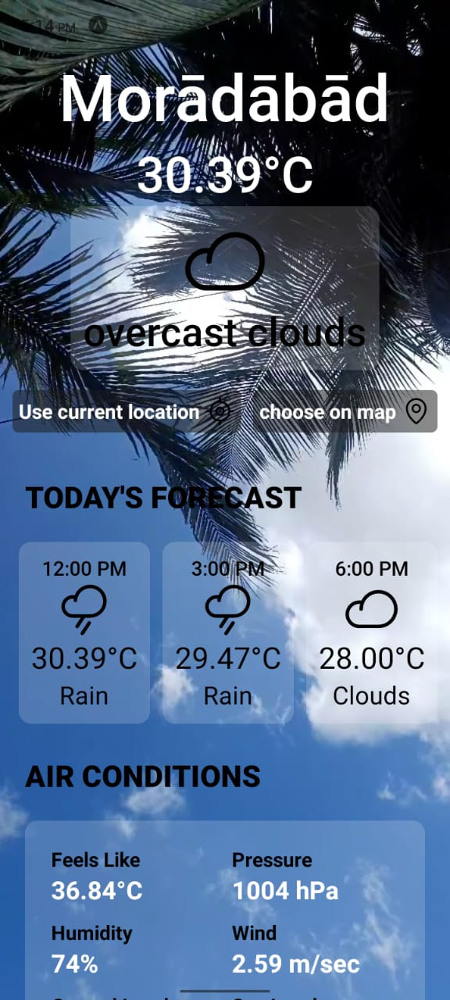
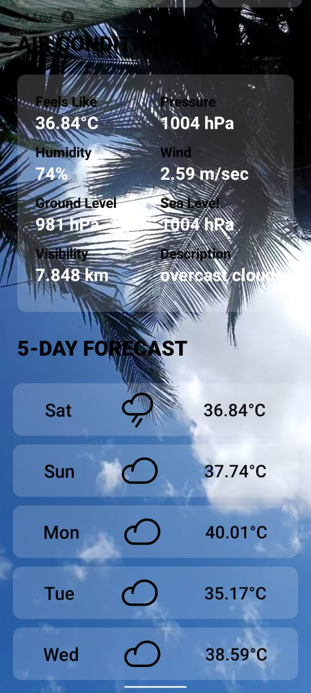
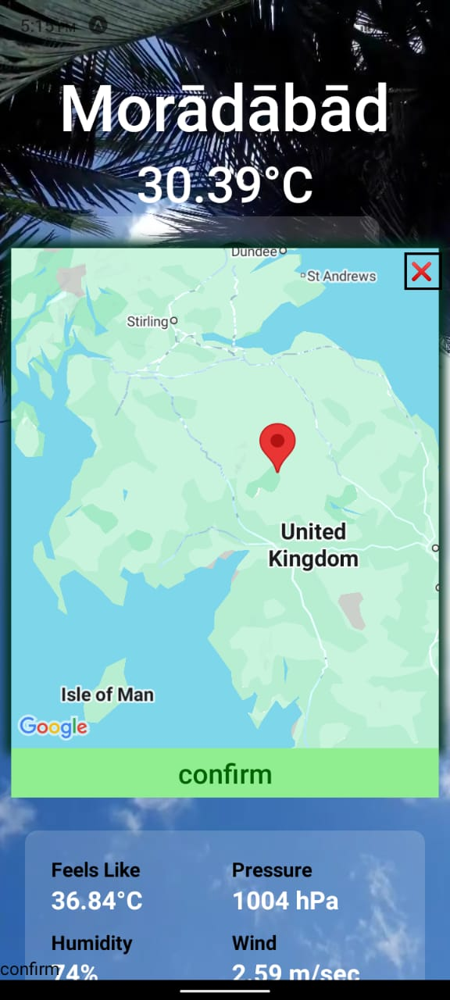

# 🌦️ Weather Forecast App

A cross-platform mobile app built with React Native, JavaScript, Expo, and the OpenWeatherMap API that provides real-time weather updates and a 5-day forecast based on user location or any selected place on the map.

---

## 🚀 Features

- 📍 Real-time weather updates based on current device location
- 📆 5-day weather forecast with clean, scrollable UI
- 🌡️ Detailed weather data: temperature, humidity, pressure, and wind speed
- 🗺️ Interactive map – tap to select any location and get full weather details, including forecast
- 🔄 Dynamic refresh and automatic location detection
- 📱 Smooth and responsive design for Android and iOS devices

---

## 📸 Screenshots

| Home Screen                      | Forecast                        | Map Selection                     | Selected Location Weather          |
| -------------------------------- | ------------------------------- | --------------------------------- | ---------------------------------- |
|  |  |  |  |

---

## 🎥 Demo Video

<a href="https://www.instagram.com/reel/DM_EBd7B4bb">
  
</a>

---

## 🔧 Get started

1. Install dependencies

   ```bash
   npm install
   ```

2. Start the app

   ```bash
   npx expo start
   ```

In the output, you'll find options to open the app in a

- [development build](https://docs.expo.dev/develop/development-builds/introduction/)
- [Android emulator](https://docs.expo.dev/workflow/android-studio-emulator/)
- [iOS simulator](https://docs.expo.dev/workflow/ios-simulator/)
- [Expo Go](https://expo.dev/go), a limited sandbox for trying out app development with Expo

You can start developing by editing the files inside the **app** directory. This project uses [file-based routing](https://docs.expo.dev/router/introduction).

## Get a fresh project

When you're ready, run:

```bash
npm run reset-project
```

This command will move the starter code to the **app-example** directory and create a blank **app** directory where you can start developing.

## Learn more

To learn more about developing your project with Expo, look at the following resources:

- [Expo documentation](https://docs.expo.dev/): Learn fundamentals, or go into advanced topics with our [guides](https://docs.expo.dev/guides).
- [Learn Expo tutorial](https://docs.expo.dev/tutorial/introduction/): Follow a step-by-step tutorial where you'll create a project that runs on Android, iOS, and the web.

## Join the community

Join our community of developers creating universal apps.

- [Expo on GitHub](https://github.com/expo/expo): View our open source platform and contribute.
- [Discord community](https://chat.expo.dev): Chat with Expo users and ask questions.
